.. _flync_example:

FLYNC Examples
===============

Welcome to the configuration examples and tutorials! This section walks you through practical usage of the ``FLYNC`` configuration system with real examples.

----------

Base Example
--------------

This example provides a fully functional reference configuration that can be used as a baseline when developing your own system setup.
It demonstrates how multiple networking features can be integrated into a cohesive design, helping you understand both structure and implementation details.

The configuration includes the following key components:

- **Ethernet Network Topology** - Illustrates how devices are interconnected, including port roles, link relationships, and overall network structure. This serves as a guide for designing scalable and deterministic Ethernet architectures.

- **Time Synchronization** - Shows how gPTP configuration is defined and maintained across the network.

- **MACsec** - Shows the configuration of MACsec-aware nodes of the system for link protection.

- **Quality of Service (QoS), Layer 2 TSN, and TCAM Usage** - Provides sample configurations for traffic prioritization and deterministic networking using Time-Sensitive Networking (TSN) features. It also illustrates how TCAM rules can be allocated and used for traffic classification and filtering. You can use this configuration as a starting point, adapting interface mappings, policies, and feature parameters to match the specific requirements of your hardware platform and application.

- **Network Management (NM)** - Shows how an NM message is modelled vendor-neutral as an ordinary PDU with ordinary signals, tagged via the ``pdu_usage`` / ``frame_usage`` fields, and bound to both Ethernet and CAN transports.

- **Signals, PDUs and CAN Communication** - Shows how bus-agnostic signals are grouped into PDUs and carried by CAN and CAN FD frames, and how the same PDUs are packed into Ethernet container PDUs.

Example Configuration
"""""""""""""""""""""""

Find an example configuration directly in `github <https://github.com/Technica-Engineering/FLYNC/tree/main/examples/flync_example>`_.

------

Ethernet Network Topology
""""""""""""""""""""""""""

The **Ethernet Network Topology** diagram provides a comprehensive visual representation of all components included in the configuration.

The diagram identifies the VLANs, IP addresses, and multicast groups assigned to each controller and switch, giving a complete view of the logical network segmentation and addressing scheme.

Each of the four ECUs is shown as an individual block. The diagram also illustrates the internal connectivity between components within each ECU, as well as the external connections between ECUs, making both intra-ECU and inter-ECU communication paths easy to understand.

.. image:: _static/images/examples/ethernet_topology.svg
   :align: center
   :width: 1300px

-------

QoS/L2 TSN and TCAM Configuration
"""""""""""""""""""""""""""""""""""

The **QoS / Layer 2 TSN and TCAM** Configuration diagram provides a comprehensive visual overview of the Time-Sensitive Networking (TSN) mechanisms and TCAM rules implemented in this configuration.

The diagram highlights the HTB (Hierarchical Token Bucket) shaper configured on the Linux-based controllers (eth_ecu), as well as the Credit-Based Shapers (CBS) applied on the egress ports of the switches to manage time-sensitive traffic.

It also shows the ingress stream filters deployed on the ingress ports of the switches, which are used for traffic policing and stream identification in accordance with TSN requirements.

In addition, the diagram includes the TCAM rules configured on the switch (z2_switch1), illustrating how hardware-based classification and filtering are used to enforce traffic handling policies.

.. image:: _static/images/examples/qos.svg
   :align: center
   :width: 1300px

-------

Time Synchronization Configuration
"""""""""""""""""""""""""""""""""""""

The **Timesync Configuration** diagram provides a clear visual overview of the time-synchronization roles assigned to all time-aware devices in the system.

It illustrates how time is distributed across the network, identifying which devices act as time-transmitters or time_receivers.

This helps clarify the synchronization hierarchy and the timing relationships between system components.

.. image:: _static/images/examples/ptp.svg
   :align: center
   :width: 1300px

-------

MACsec Configuration
"""""""""""""""""""""""

The **MACsec Configuration** diagram provides a clear visual overview of the roles and relationships of all MACsec participants within the system.

It identifies which devices function as MACsec peers, showing where secure channels are established and how link-layer protection is applied across the network.

This helps clarify the security topology and illustrates how data integrity (and confidentiality) is maintained between connected nodes.

.. image:: _static/images/examples/macsec.svg
   :align: center
   :width: 1300px

-------

Further Examples
--------------------

ECU Variants
""""""""""""""

Variant 1: Single controller, single (virtual) interface, external PHY
^^^^^^^^^^^^^^^^^^^^^^^^^^^^^^^^^^^^^^^^^^^^^^^^^^^^^^^^^^^^^^^^^^^^^^

Find this example on github: `ecu_variant_1 <https://github.com/Technica-Engineering/FLYNC/tree/main/examples/ecu_variants/ecu_variant_1_single_controller_single_iface_ext_PHY>`_.

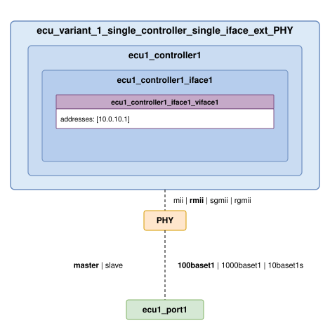

.. note:: The MDI configuration must be compliant with that of the other ECU to which the port is connected to. In this case, ``mode``, ``speed`` and ``duplex`` must match; while ``role`` must be opposite to that of the other ECU config (i.e., if slave in the connected ECU, master shall be configured).

.. note:: The MII configuration must be compliant with that of the ECU controller configuration. In this case, ``type`` and ``speed`` must match; while ``mode`` must oppose the controller interface config (i.e., if mac in the controller interface, phy shall be configured).

--------------

Variant 2: Single controller, single (virtual) interface, integrated PHY
^^^^^^^^^^^^^^^^^^^^^^^^^^^^^^^^^^^^^^^^^^^^^^^^^^^^^^^^^^^^^^^^^^^^^^^^

Find this example on github: `ecu_variant_2 <https://github.com/Technica-Engineering/FLYNC/tree/main/examples/ecu_variants/ecu_variant_2_single_controller_single_iface_int_PHY>`_.

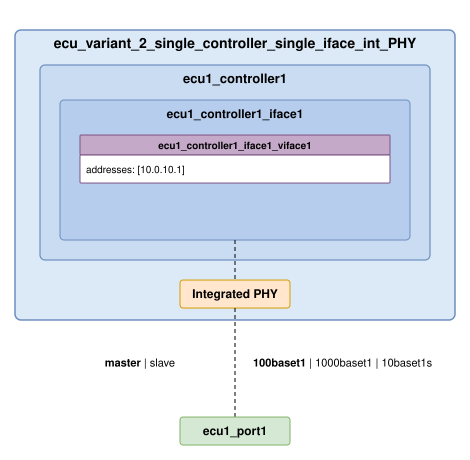

.. note:: Since PHY is integrated into the host controller, no MII configuration is needed neither on the port side, nor on the controller side.

--------------

Variant 3: Single controller, multiple (virtual) interfaces, external PHY
^^^^^^^^^^^^^^^^^^^^^^^^^^^^^^^^^^^^^^^^^^^^^^^^^^^^^^^^^^^^^^^^^^^^^^^^^^

Find this example on github: `ecu_variant_3 <https://github.com/Technica-Engineering/FLYNC/tree/main/examples/ecu_variants/ecu_variant_3_single_controller_multiple_iface_ext_PHY>`_.

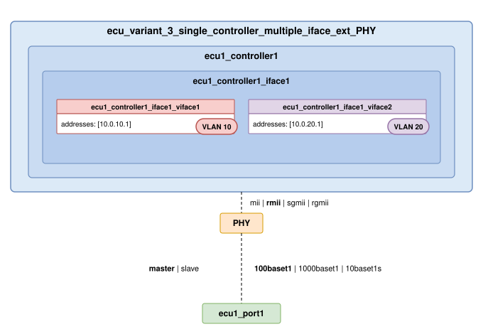

--------------

Variant 4: Single controller, multiple (virtual) interfaces, integrated PHY
^^^^^^^^^^^^^^^^^^^^^^^^^^^^^^^^^^^^^^^^^^^^^^^^^^^^^^^^^^^^^^^^^^^^^^^^^^^^

Find this example on github: `ecu_variant_4 <https://github.com/Technica-Engineering/FLYNC/tree/main/examples/ecu_variants/ecu_variant_4_single_controller_multiple_iface_int_PHY>`_.

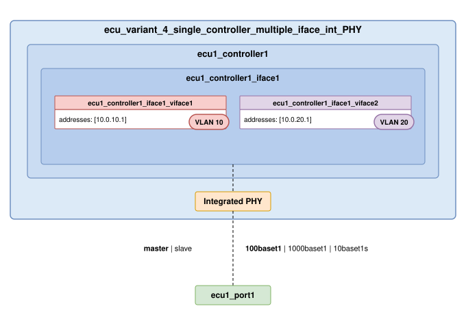

--------------

Variant 5: Single controller, single (physical) interface, external PHY, Multiple VMs
^^^^^^^^^^^^^^^^^^^^^^^^^^^^^^^^^^^^^^^^^^^^^^^^^^^^^^^^^^^^^^^^^^^^^^^^^^^^^^^^^^^^^^^

Find this example on github: `ecu_variant_5 <https://github.com/Technica-Engineering/FLYNC/tree/main/examples/ecu_variants/ecu_variant_5_single_controller_single_iface_multiple_vms>`_.

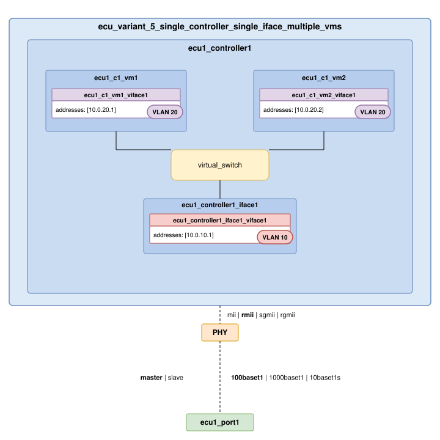

.. note:: If there is a VM, it needs to tie to a Controller Interface through a Virtual Switch.

--------------

Variant 6: Single controller, multiple (physical) interface, external PHY no VMs, Virtual Switch
^^^^^^^^^^^^^^^^^^^^^^^^^^^^^^^^^^^^^^^^^^^^^^^^^^^^^^^^^^^^^^^^^^^^^^^^^^^^^^^^^^^^^^^^^^^^^^^^

Find this example on github: `ecu_variant_6 <https://github.com/Technica-Engineering/FLYNC/tree/main/examples/ecu_variants/ecu_variant_6_single_controller_multiple_iface_physical_ext_phy>`_.

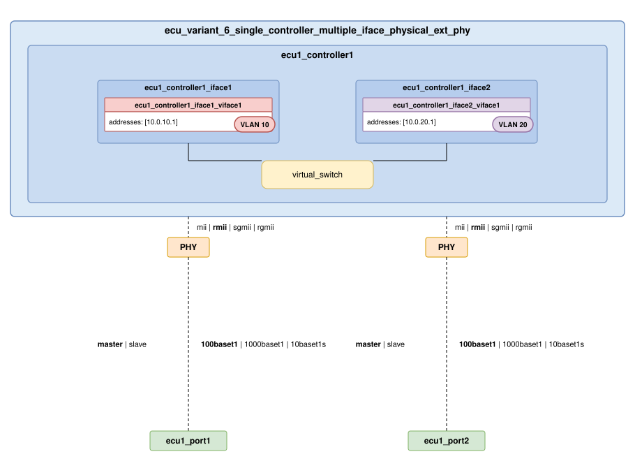

.. note:: Two controller interfaces might be connected through an Virtual Switch.

--------------

Variant 7: Switch ECU, multiple (virtual) interfaces, external PHY
^^^^^^^^^^^^^^^^^^^^^^^^^^^^^^^^^^^^^^^^^^^^^^^^^^^^^^^^^^^^^^^^^^

Find this example on github: `ecu_variant_7 <https://github.com/Technica-Engineering/FLYNC/tree/main/examples/ecu_variants/ecu_variant_7_switch_ecu_ext_PHY>`_.

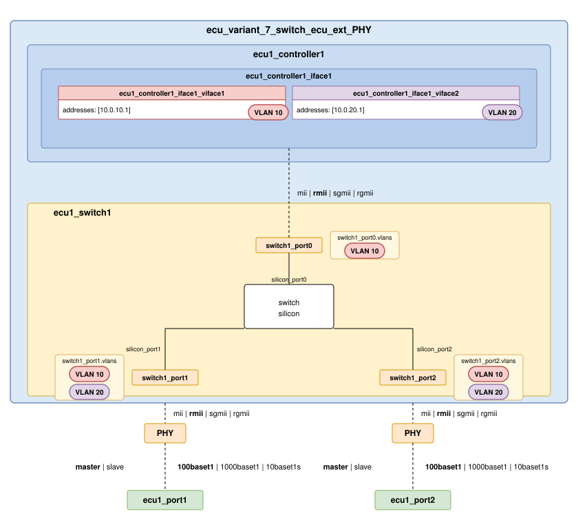

.. note:: The MII ``mode`` of the ``switch1_port0`` must oppose the one of the ``ecu1_controller1_iface1``.

--------------

Variant 8: Switch ECU with Host controller, multiple (virtual) interfaces, external PHY
^^^^^^^^^^^^^^^^^^^^^^^^^^^^^^^^^^^^^^^^^^^^^^^^^^^^^^^^^^^^^^^^^^^^^^^^^^^^^^^^^^^^^^^^

Find this example on github: `ecu_variant_8 <https://github.com/Technica-Engineering/FLYNC/tree/main/examples/ecu_variants/ecu_variant_8_switch_ecu_with_host_ext_PHY>`_.

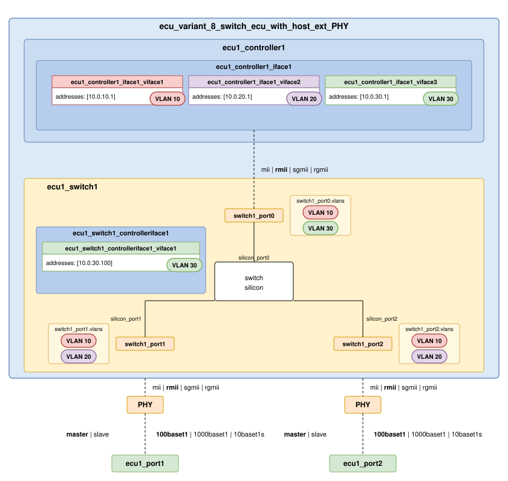

.. note:: The MII ``mode`` of the ``switch1_port0`` must **oppose** the one of the ``ecu1_controller1_iface1``.

.. note:: The Host controller of the switch will have the same configuration as any Controller Interface.

--------------

Variant 9: Single controller, single Ethernet interface and a CAN interface
^^^^^^^^^^^^^^^^^^^^^^^^^^^^^^^^^^^^^^^^^^^^^^^^^^^^^^^^^^^^^^^^^^^^^^^^^^^^

Find this example on github: `ecu_variant_9 <https://github.com/Technica-Engineering/FLYNC/tree/main/examples/ecu_variants/ecu_variant_9_single_controller_eth_iface_can_iface>`_.

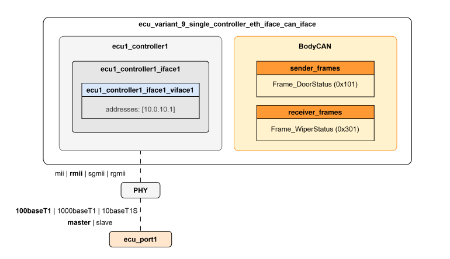

.. note:: A single controller can host a CAN interface alongside its Ethernet interface. The Ethernet interface has its own ECU port and external PHY; the CAN interface instead joins a bus via ``bus_ref`` and lists the frames it exchanges through ``sender_frames`` / ``receiver_frames``.

.. note:: Several CAN frames share the single ``BodyCAN`` bus. The frames are defined once on the bus under ``communication/channels/can/``, and the CAN interface references them by their ``frame_ref`` (the CAN identifier).

--------------

Internal Topology (Configuration and Types)
""""""""""""""""""""""""""""""""""""""""""""""

The internal topology file of each configured ECU must contain the description of all the internal connections within the device. The FLYNC model supports the connection types present in the following picture:

.. important:: Be aware of the kind of connection that is added to the file, since the name of the components shall adjust to it accordingly.

**Example file (dummy example)**

.. image:: ./_static/images/internal_topology/internal_topology.png
   :align: center
   :width: 1000px

.. dropdown:: 📄 ``ecu1_internal_topology.flync.yaml``

   .. code-block:: yaml

      connections:
         -  type: ecu_port_to_switch_port
            id: conn1
            ecu_port: ecu1_port2
            switch_port: switch1_port1
         -  type: ecu_port_to_switch_port
            id: conn2
            ecu_port: ecu1_port3
            switch_port: switch1_port2
         -  type: ecu_port_to_switch_port
            id: conn3
            ecu_port: ecu1_port4
            switch_port: switch2_port1
         -  type: ecu_port_to_switch_port
            id: conn4
            ecu_port: ecu1_port5
            switch_port: switch2_port2
         -  type: ecu_port_to_controller_interface
            id: conn5
            ecu_port: ecu1_port1
            controller_interface: ecu1_controller1_iface1
         -  type: switch_port_to_controller_interface
            id: conn6
            switch_port: switch1_port0
            controller_interface: ecu1_controller1_iface2
         -  type: switch_port_to_controller_interface
            id: conn7
            switch_port: switch2_port0
            controller_interface: ecu1_controller2_iface1
         -  type: controller_interface_to_controller_interface
            id: conn8
            controller_interface: ecu1_controller1_iface2
            controller_interface2: ecu1_controller2_iface1
         -  type: switch_port_to_switch_port
            id: conn9
            switch_port: switch1_port3
            switch2_port: switch2_port3

--------------

Additional Security Features Configuration
""""""""""""""""""""""""""""""""""""""""""""

Firewall Configuration
^^^^^^^^^^^^^^^^^^^^^^

The Firewall model consists of a default action and three lists defining rules for input, output and forward traffic, respectively.
Each of these rules contains a pattern the packets are matched against, and an action executed when this check is positive:

.. dropdown:: 📄 ``ecu1_controller1.flync.yaml``

   .. code-block:: yaml

      meta:
         author: Developer1
         compatible_flync_version:
            version_schema: semver
            version: 0.11.0
      name: ecu1_controller1
      interfaces:
         -  name: ecu1_controller1_iface1
            mac_address: 00:11:22:33:44:88
            mii_config:
            type: rmii
            speed: 100
            mode: mac
            virtual_interfaces:
            -  name: ecu1_controller1_iface1_viface1
               vlanid: 0
               addresses:
                  -  address: 10.0.10.3
                     ipv4_netmask: 255.255.255.0
            firewall:
               default_action: drop
               input_rules:
                  -  name: allow_ssh
                     action: accept
                     pattern:
                     src_ipv4: 10.0.0.2
                     protocol: tcp
                     dst_port: 22
                     vlan_tagged: true
               output_rules:
                  -  name: drop_output_vlan_33
                     action: drop
                     pattern:
                     dst_ipv4:
                        address: 10.0.0.1
                        ipv4netmask : 255.255.255.0
                     vlanid: 33
               forward_rules:
                  -  name: allow_forwarded_udp
                     action: accept
                     pattern:
                     src_ipv4:
                        address: 10.0.0.2
                        ipv4netmask : 255.255.255.0
                     dst_ipv4:
                        address: 10.0.0.3
                        ipv4netmask : 255.255.255.0
                     protocol: udp
                     dst_port:
                           from_value: 30490
                           to_value: 30509

--------------

Switch TCAM Configuration
^^^^^^^^^^^^^^^^^^^^^^^^^^^^

.. image:: ./_static/images/tcam_rules/tcam_rules.png
   :align: center
   :width: 1000px

.. dropdown:: 📄 ``ecu1_switch1.flync.yaml``

   .. code-block:: yaml

         meta:
            author: Developer1
            compatible_flync_version:
               version_schema: semver
               version: 0.11.0
         name: ecu_switch1
         ports:
         -  name: switch_port0
            silicon_port_no: 1
            default_vlan_id: 1
            mii_config:
               type: rmii
               speed: 100
               mode: mac

         -  name: switch_port1
            silicon_port_no: 2
            default_vlan_id: 1
            mii_config:
               type: rmii
               speed: 100
               mode: mac

         -  name: switch_port2
            silicon_port_no: 3
            default_vlan_id: 1
            mii_config:
               type: rmii
               speed: 100
               mode: mac

         tcam_rules:
            -  name: Rule_1
               match_filter:
               src_mac:
                  address: "10:10:10:22:22:22"
                  macmask: "FF:FF:FF:FF:FF:FF"
               vlanid: 20
               pcp: 2
               protocol: udp
               dst_port:
                  from_value: 32000
                  to_value: 33000
               match_ports: [switch_port1]
               action:
               -  type: drop
                  ports: [switch_port2]

            -  name: Rule_2
               match_filter:
               src_mac:
                  address: "10:10:10:20:20:20"
                  macmask: "FF:FF:FF:FF:FF:EE"
               vlanid: 20
               pcp: 5
               protocol: udp
               dst_port:
                  from_value: 32000
                  to_value: 33000
               match_ports: [switch_port0, switch_port1]
               action:
                  -  type: vlan_overwrite
                     overwrite_vlan_id: 10
                     overwrite_vlan_pcp: 1
                     ports: [switch_port2]

         vlans:
         -  name: VLAN10
            id: 10
            default_priority: 1
            ports:
               - switch_port0
               - switch_port1
               - switch_port2

         -  name: VLAN20
            id: 20
            default_priority: 1
            ports:
               - switch_port0
               - switch_port1
               - switch_port2

--------------

Sockets Configuration
""""""""""""""""""""""""

A socket in FLYNC represents a logical endpoint on a virtual network interface of an ECU. It defines how the controller will send and receive traffic over a specific IP address, port, and protocol (TCP/UDP).

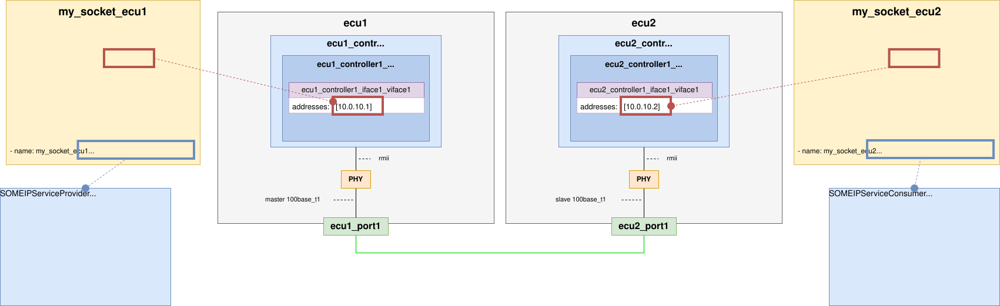

.. note:: Sockets must be defined in a separate folder for each ECU for better readability.
.. note:: Multiple sockets may be defined in a single file for different address endpoints, but they must belong to the same VLAN.

-------

Signals
"""""""

A **Signal** is the smallest data element in the ``FLYNC`` model: a single value with its bit length, optional linear scaling (``factor`` / ``offset`` / ``unit``) and limits, and an optional ``value_encoding`` that maps raw values to labels (``text_table``, ``bitfield_text_table`` or ``bitmask_flags``). Signals are bus-agnostic and are placed into a PDU through a *signal instance* that fixes the ``bit_position`` and ``endianness``.

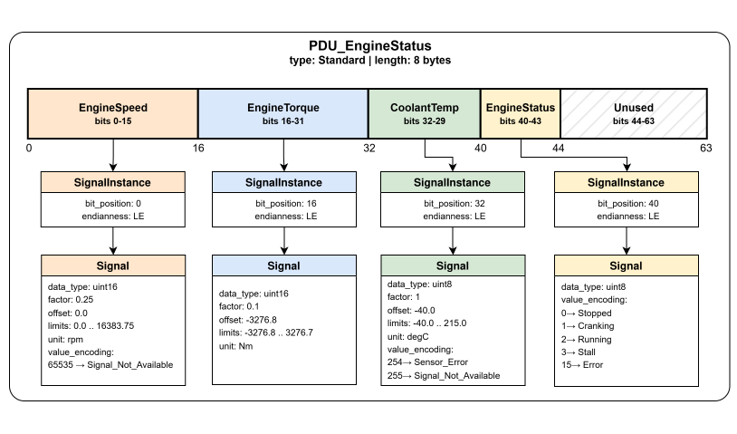

.. dropdown:: 📄 ``communication/channels/pdus/PDU_EngineStatus.flync.yaml``

   .. code-block:: yaml

      name: PDU_EngineStatus
      type: standard
      length: 8
      description: >-
        Engine speed, torque, coolant temperature and operating state.
        Transmitted cyclically at 10 ms by EngineECU on PowertrainCAN.

      signals:
        - bit_position: 0
          endianness: LE

          signal:
            name: EngineSpeed
            description: Crankshaft rotational speed.
            bit_length: 16
            data_type: uint16
            factor: 0.25
            offset: 0.0
            lower_limit: 0.0
            upper_limit: 16383.75
            unit: rpm
            value_encoding:
              type: text_table
              entries:
                - value: 65535
                  label: Signal_Not_Available
                  
        - bit_position: 16
          endianness: LE

          signal:
            name: EngineTorque
            description: Indicated engine torque at crankshaft.
            bit_length: 16
            data_type: int16
            factor: 0.1
            offset: 0.0
            lower_limit: -3276.8
            upper_limit: 3276.7
            unit: Nm
        - bit_position: 32
          endianness: LE

          signal:
            name: EngineCoolantTemp
            description: Engine coolant temperature.
            bit_length: 8
            data_type: uint8
            factor: 1.0
            offset: -40.0
            lower_limit: -40.0
            upper_limit: 215.0
            unit: degC
            value_encoding:
              type: text_table
              entries:
                - value: 254
                  label: Sensor_Error
                - value: 255
                  label: Signal_Not_Available
        - bit_position: 40
          endianness: LE

          signal:
            name: EngineStatus
            description: Engine operating state.
            bit_length: 4
            data_type: uint8
            value_encoding:
              type: text_table
              entries:
                - value: 0
                  label: Stopped
                - value: 1
                  label: Cranking
                - value: 2
                  label: Running
                - value: 3
                  label: Stall
                - value: 15
                  label: Error

.. note:: Signals are defined inline inside the PDU that carries them, under ``communication/channels/pdus/``.

-------

PDUs
""""

A **PDU** (Protocol Data Unit) is the container that groups signals for transmission. PDUs are defined independently of any bus and stored under ``communication/channels/pdus/`` (Ethernet container PDUs live in ``communication/channels/ethernet_pdu_containers/``). A frame, a socket, or another PDU then references a PDU **by name**.

Three PDU types are distinguished by the ``type`` discriminator:

- ``standard`` - a non-multiplexed PDU carrying a flat list of signal instances.
- ``multiplexed`` - a PDU with a ``selector_signal`` whose value selects which ``mux_groups`` block of signals is active on each transmission cycle.
- ``container`` - a Container PDU that packs several other PDUs into one payload, each contained PDU prefixed by a per-slot header.

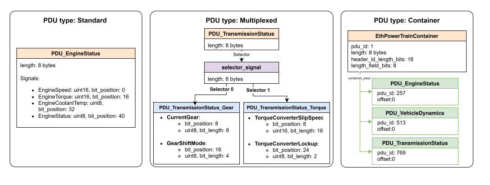

**Multiplexed PDU**

``PDU_TransmissionStatus`` multiplexes on the 4-bit ``GearInfoMux`` selector: selector value ``0`` activates the gear-position signals, value ``1`` the torque-converter signals.

.. dropdown:: 📄 ``communication/channels/pdus/PDU_TransmissionStatus.flync.yaml``

   .. code-block:: yaml

      name: PDU_TransmissionStatus
      type: multiplexed
      length: 8
      description: Transmission status, multiplexed on GearInfoMux selector.

      selector_signal:
        bit_position: 0
        endianness: LE
        signal:
          name: GearInfoMux
          description: Multiplexer selector for TransmissionStatus PDU.
          bit_length: 4
          data_type: uint8

      mux_groups:
        - selector_value: 0
          pdu:
            name: PDU_TransmissionStatus_Gear
            type: standard
            length: 8
            signals:
              - bit_position: 8
                endianness: LE

                signal:
                  name: CurrentGear
                  description: Currently engaged gear.
                  bit_length: 8
                  data_type: uint8
                  value_encoding:
                    type: text_table
                    entries:
                      - value: 0
                        label: Park
                      - value: 1
                        label: Reverse
                      - value: 2
                        label: Neutral
                      - value: 3
                        label: Drive_D1
                      - value: 4
                        label: Drive_D2
                      - value: 5
                        label: Drive_D3
                      - value: 6
                        label: Drive_D4
              - bit_position: 16
                endianness: LE

                signal:
                  name: GearShiftMode
                  description: Automatic / manual / sport shift mode.
                  bit_length: 4
                  data_type: uint8
                  value_encoding:
                    type: text_table
                    entries:
                      - value: 0
                        label: Automatic
                      - value: 1
                        label: Manual
                      - value: 2
                        label: Sport
        - selector_value: 1
          pdu:
            name: PDU_TransmissionStatus_Torque
            type: standard
            length: 8
            signals:
              - bit_position: 8
                endianness: LE

                signal:
                  name: TorqueConverterSlipSpeed
                  description: Slip speed of the torque converter.
                  bit_length: 16
                  data_type: uint16
                  factor: 0.1
                  offset: 0.0
                  unit: rpm
              - bit_position: 24
                endianness: LE

                signal:
                  name: TorqueConverterLockup
                  description: Torque converter lock-up clutch state.
                  bit_length: 2
                  data_type: uint8
                  value_encoding:
                    type: text_table
                    entries:
                      - value: 0
                        label: Open
                      - value: 1
                        label: Slipping
                      - value: 2
                        label: Locked
                      - value: 3
                        label: Error

**Container PDU**

``EthPowertrainContainer`` bundles three application PDUs - ``PDU_EngineStatus``, ``PDU_VehicleDynamics`` and ``PDU_TransmissionStatus`` - into one Ethernet payload. The per-slot ``header`` gives the bit widths of the PDU-ID and length fields, and each contained PDU declares its ``pdu_id`` and byte ``offset`` inside the container.

.. dropdown:: 📄 ``communication/channels/ethernet_pdu_containers/eth_powertrain_container.flync.yaml``

   .. code-block:: yaml

      name: EthPowertrainContainer
      type: container
      pdu_id: 1
      length: 31
      header:
        id_length_bits: 16
        length_field_bits: 8
      description: >-
        Container PDU bundling powertrain PDUs (engine status, vehicle dynamics,
        transmission state) into a single Ethernet payload.

      contained_pdus:
        - pdu_id: 257
          pdu_ref: PDU_EngineStatus
          offset: 0
        - pdu_id: 513
          pdu_ref: PDU_VehicleDynamics
          offset: 11
        - pdu_id: 769
          pdu_ref: PDU_TransmissionStatus
          offset: 20

.. note:: The ``communication/channels/pdus/`` directory is optional and may be omitted when no PDUs are defined.

-------

CAN Buses
"""""""""

A **CAN Bus** carries frames between controllers. Each bus is stored in its own file under ``communication/channels/can/`` and defines the bus-level parameters plus the full list of frames transmitted on it. Both **classical CAN** and **CAN FD** are supported by the same bus type: setting ``fd_enabled: true`` (together with an ``fd_baud_rate``) permits ``can_fd`` frames with payloads up to 64 bytes and an optional bit-rate switch.

Each frame references its payload PDU by name via ``packed_pdus`` and may carry an optional ``timing`` block driving cyclic and event-driven transmission.

``DiagCAN`` is a CAN FD bus (500 kbit/s nominal, 2 Mbit/s data phase). Its ``can_fd`` frames set ``bit_rate_switch`` and carry 64-byte diagnostic payloads. It also carries the Network Management frame documented in the NM example.

.. dropdown:: 📄 ``communication/channels/can/diag_can.flync.yaml``

   .. code-block:: yaml

      name: DiagCAN
      description: Diagnostics bus at 500 kbit/s nominal / 2 Mbit/s data phase (CAN FD).
      version: "1.0"
      baud_rate: 500000
      fd_enabled: true
      fd_baud_rate: 2000000

      frames:

        - name: Frame_LightDiagRequest
          type: can_fd
          description: Functional diagnostic request, CAN FD 64-byte payload.
          length: 64
          can_id: 2015         # 0x7DF
          id_format: standard_11bit
          bit_rate_switch: true
          error_state_indicator: false
          packed_pdus:
            - pdu_ref: PDU_CabinLight
              bit_position: 0

        - name: Frame_EngineDiagResponse
          type: can_fd
          description: Diagnostic response from HPC, CAN FD 64-byte payload.
          length: 64
          can_id: 2024         # 0x7E8
          id_format: standard_11bit
          bit_rate_switch: true
          error_state_indicator: false
          packed_pdus:
            - pdu_ref: PDU_EngineStatus
              bit_position: 0

        # --------------------------------------------------------------------------
        # Frame: NmMessage (0x500, 8 bytes, sent cyclically by HPC, the sole modelled
        # NM-sending ECU on this bus). Tagged frame_usage: network_management;
        # carries PDU_NmMessage. Receivers are implicit external NM peers because HPC
        # is the only DiagCAN-connected ECU in this workspace; in a multi-ECU CAN
        # setup, peer ECUs would add Frame_NmMessage under receiver_frames on their
        # own DiagCAN interface.
        # --------------------------------------------------------------------------
        - name: Frame_NmMessage
          type: can
          frame_usage: network_management
          description: >-
            Network Management frame on DiagCAN. Sent cyclically by HPC, the sole
            NM-sending ECU modelled in this workspace. Carries the ordinary NM PDU
            (PDU_NmMessage) as its payload.
          length: 8
          can_id: 1280         # 0x500
          id_format: standard_11bit
          packed_pdus:
            - pdu_ref: PDU_NmMessage
              bit_position: 0
          timing:
            cyclic_timings:
              - cycle: 0.5
            event_timings: []

Which frames a controller sends and receives is declared on its **CAN interface**, one file per bus, where frames are referenced by ``bus_ref`` and their numeric ``frame_ref`` (the CAN ID). On ``DiagCAN``, ``high_performance_compute`` sends the diagnostic-response and Network-Management frames and receives the diagnostic request:

.. dropdown:: 📄 ``ecus/high_performance_compute/controllers/hpc_controller1/can_interfaces/diag_can_interface.flync.yaml``

   .. code-block:: yaml

      bus_ref: DiagCAN
      sender_frames:
        - bus_ref: DiagCAN
          frame_ref: 2024  # Frame_EngineDiagResponse (0x7E8)
        - bus_ref: DiagCAN
          frame_ref: 1280  # Frame_NmMessage (0x500)
      receiver_frames:
        - bus_ref: DiagCAN
          frame_ref: 2015  # Frame_LightDiagRequest (0x7DF)

.. note:: The ``communication/channels/can/`` directory is optional and may be omitted when no CAN buses are defined.

-------

.. _flync_example_nm:

Network Management (NM)
""""""""""""""""""""""""""

The example illustrates how vendor-neutral state management membership is configured around **vehicle functions** (``AutonomousDriving``, ``Comfort``, …). Instead of per-node NM identity, each participant declares which function it contributes to, and several nodes may share the same function. The example spans Ethernet, CAN, and LIN within one vehicle-wide state management group, ``VEHICLE`` (see :ref:`flync_4_nm` for the model).

The NM message is modelled as an ordinary PDU (``PDU_NmMessage``) with ordinary signals:

- ``sender_id`` (uint8) - identifies the sending node.
- ``control_vector`` (uint8) - control bits of the NM message:
  ``repeat_message_request``, ``sleep_ready``, ``active_wakeup``, and
  ``relevance_vector_present``.
- ``relevance_vector`` (uint32) - a relevance bitmask whose flags are vehicle
  **functions** (``AutonomousDriving``, ``OnlineCommunication``, ``Comfort``),
  not nodes. A participant references the function bit it contributes to;
  several ECUs may share the same function bit, and one ECU may reference
  several. The set
  of flags always matches the derived participant bits of this workspace.
- ``user_data`` (bytearray, 2 bytes) - opaque OEM/application extension area.

*Hint: This layout is one illustrative arrangement - FLYNC prescribes no NM PDU format. Each field is an ordinary signal at a configurable bit_position, so a workspace can reorder, resize or rename them (e.g. swap sender id and control vector) to match its stack.*

The PDU is flagged ``pdu_usage: network_management`` regardless of which transport technology carries it.

**State management group**

The group registry lives in ``communication/state_management/groups.flync.yaml`` (with the reusable timing profiles in ``timing_profiles.flync.yaml``); memberships are declared entity-side only. The workspace exercises every use case:

.. list-table::
   :header-rows: 1
   :widths: 45 55

   * - Use case
     - Where to look
   * - Controller-level membership (recommended site); one ECU owning several
       function bits (``AutonomousDriving`` + ``OnlineCommunication``)
     - ``ecus/high_performance_compute/controllers/hpc_controller2/state_memberships.flync.yaml``
   * - ECU-level membership; several ECUs sharing one function bit (``Comfort``)
     - ``ecus/zonal_gateway/``, ``ecus/can_node_*/``
   * - Bus-level membership - the LIN bus participates as one bit with no NM
       frame (master-as-proxy)
     - ``communication/channels/lin/body_lin.flync.yaml``
   * - Gateway use case - receives the NM PDU on Ethernet and forwards it onto
       BodyCAN via ordinary ``sender_frames`` (plain cross-bus forwarding)
     - ``ecus/zonal_gateway/``
   * - Switch use case - the switch-core controller observes the group
     - ``ecus/zonal_platform2/controllers/z2_controller2/state_memberships.flync.yaml``
   * - Derived proxy - ``zonal_platform1`` declares no membership itself; as
       BodyLIN's master, validation derives it as the bus's representative (it
       receives the group state on Ethernet and drives BodyLIN to sleep)
     - ``zonal_platform1``

**Ethernet NM**

The ``VEHICLE`` NM PDU (``PDU_NmMessage``) is wrapped in an Ethernet Container PDU (``eth_nm_container_a``) and bound to a UDP socket via the ``pdu_sender`` / ``pdu_receiver`` deployment types:

- **Sender** - ``high_performance_compute`` transmits the NM container multicast on VLAN 40, group ``224.0.0.1``, UDP port 1200, and also receives it via ``pdu_receiver`` so it can observe the group state.
- **Receivers** - ``zonal_platform1``, ``zonal_platform2``, and ``zonal_gateway`` receive it via ``pdu_receiver`` sockets on the same VLAN and multicast group.

As an alternative way, the NM PDU (``PDU_NmMessage``) can be attached to a Ethernet Container PDU (available as example ``eth_nm_container_b``) **which does not carry a PDU Header**, as ``header/id_length_bits`` & ``length_field_bits`` are configured with length zero (``0``), to be sent as a raw UDP payload as example Use-Case.

**CAN NM**

On ``BodyCAN``, the ``VEHICLE`` group follows the classic CAN pattern: ``zonal_gateway`` feeds ``Frame_Nm_Gateway`` (forwarding the NM PDU from Ethernet onto BodyCAN), while ``can_node_1`` / ``can_node_2`` each transmit their own NM frame and receive the others. All three contribute to the ``Comfort`` function, so they share the ``Comfort`` relevance bit - requesting Comfort keeps them awake together, which is how CAN resolves NM state per function.

``DiagCAN`` carries the vehicle NM PDU (``PDU_NmMessage``) in ``Frame_NmMessage``, tagged ``frame_usage: network_management``, sent by ``high_performance_compute`` - a second CAN bus of the same ``VEHICLE`` group. It is a plain diagnostics bus otherwise; it declares no membership of its own.

**LIN NM**

``BodyLIN`` (the body bus - exterior mirrors and cabin ambient lighting) takes part through a **bus-level membership**: the whole bus joins the ``VEHICLE`` group as one participant on the ``Comfort`` function, without a LIN frame of its own. Its master (``zonal_platform1``) receives the group state on Ethernet (``pdu_receiver``) and drives the LIN bus to sleep with it; validation resolves the master as the bus's representative automatically.
